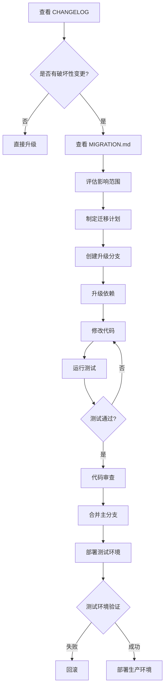

# 升级指南

本文档帮助各个项目安全、高效地升级组件库版本。

## 升级前准备

### 1. 查看变更日志

升级前务必查看 [CHANGELOG.md](./CHANGELOG.md)，了解：
- 新增了哪些功能
- 修复了哪些 bug
- 是否有破坏性变更

### 2. 检查当前版本

```bash
# 查看项目中使用的版本
npm list @company/element-business-components

# 查看 npm 上的最新版本
npm view @company/element-business-components version

# 查看所有可用版本
npm view @company/element-business-components versions
```

### 3. 评估升级风险

| 升级类型 | 示例 | 风险等级 | 建议 |
|---------|------|---------|------|
| Patch | 1.0.0 → 1.0.1 | 🟢 低 | 可直接升级 |
| Minor | 1.0.0 → 1.1.0 | 🟡 中 | 测试后升级 |
| Major | 1.0.0 → 2.0.0 | 🔴 高 | 仔细评估，充分测试 |

---

## 升级策略

### 策略 1：保守升级（推荐生产环境）

**只升级 Patch 版本，获取 bug 修复**

```json
{
  "dependencies": {
    "@company/element-business-components": "~1.0.0"
  }
}
```

**升级步骤：**
```bash
# 1. 查看可用的 patch 版本
npm view @company/element-business-components versions --json | grep "1.0"

# 2. 升级到最新的 patch 版本
npm update @company/element-business-components

# 3. 测试
npm test

# 4. 提交
git add package.json package-lock.json
git commit -m "chore: upgrade element-business-components to 1.0.x"
```

**优点：**
- ✅ 风险最低
- ✅ 获得 bug 修复
- ✅ 不会引入新功能

**缺点：**
- ❌ 无法使用新功能

---

### 策略 2：渐进升级（推荐开发环境）

**逐步升级 Minor 版本，获取新功能**

```json
{
  "dependencies": {
    "@company/element-business-components": "^1.0.0"
  }
}
```

**升级步骤：**
```bash
# 1. 升级到最新的 minor 版本
npm update @company/element-business-components

# 2. 查看实际升级的版本
npm list @company/element-business-components

# 3. 查看变更日志
# 访问 https://github.com/your-org/element-doc/blob/main/CHANGELOG.md

# 4. 运行测试
npm test

# 5. 手动测试使用了组件库的页面

# 6. 提交
git add package.json package-lock.json
git commit -m "chore: upgrade element-business-components to 1.x.x"
```

**优点：**
- ✅ 获得新功能和 bug 修复
- ✅ 向后兼容

**缺点：**
- ⚠️ 可能引入意外的行为变化

---

### 策略 3：跨大版本升级（需谨慎）

**升级到新的 Major 版本**

```bash
# 1. 创建新分支
git checkout -b upgrade/element-components-v2

# 2. 查看迁移指南
# 访问 https://github.com/your-org/element-doc/blob/main/MIGRATION.md

# 3. 升级到新版本
npm install @company/element-business-components@2.0.0

# 4. 根据迁移指南修改代码

# 5. 运行测试
npm test

# 6. 手动测试所有使用了组件库的页面

# 7. 代码审查

# 8. 合并到主分支
```

**注意事项：**
- 🔴 必须查看 [MIGRATION.md](./MIGRATION.md)
- 🔴 必须进行充分测试
- 🔴 建议在测试环境先验证
- 🔴 建议分批次上线

---

## 升级流程

### 标准升级流程



### 快速升级流程（Patch 版本）

```bash
# 一键升级脚本
#!/bin/bash

echo "开始升级组件库..."

# 1. 备份当前版本
CURRENT_VERSION=$(npm list @company/element-business-components --depth=0 | grep @company | awk '{print $2}')
echo "当前版本: $CURRENT_VERSION"

# 2. 升级
npm update @company/element-business-components

# 3. 获取新版本
NEW_VERSION=$(npm list @company/element-business-components --depth=0 | grep @company | awk '{print $2}')
echo "新版本: $NEW_VERSION"

# 4. 运行测试
echo "运行测试..."
npm test

if [ $? -eq 0 ]; then
    echo "✅ 升级成功！"
    git add package.json package-lock.json
    git commit -m "chore: upgrade element-business-components from $CURRENT_VERSION to $NEW_VERSION"
else
    echo "❌ 测试失败，回滚..."
    git checkout package.json package-lock.json
    npm install
fi
```

---

## 多项目升级管理

### 场景：公司有 10 个项目使用组件库

#### 方案 1：统一升级（推荐）

**建立升级计划表：**

| 项目 | 当前版本 | 目标版本 | 优先级 | 负责人 | 状态 |
|------|---------|---------|--------|--------|------|
| 项目 A | 1.0.0 | 1.2.0 | 高 | 张三 | ✅ 已完成 |
| 项目 B | 1.0.0 | 1.2.0 | 高 | 李四 | 🔄 进行中 |
| 项目 C | 0.9.0 | 1.2.0 | 中 | 王五 | ⏳ 待开始 |
| 项目 D | 1.1.0 | 1.2.0 | 低 | 赵六 | ⏳ 待开始 |

**升级顺序：**
1. 新项目优先（风险低）
2. 活跃项目其次（收益高）
3. 稳定项目最后（风险高）

#### 方案 2：使用 Renovate Bot 自动化

**配置 `.github/renovate.json`：**

```json
{
  "extends": ["config:base"],
  "packageRules": [
    {
      "matchPackagePatterns": ["@company/element-business-components"],
      "groupName": "element-business-components",
      "automerge": false,
      "schedule": ["every weekend"],
      "labels": ["dependencies", "component-library"],
      "reviewers": ["team:frontend"],
      "prCreation": "immediate"
    }
  ]
}
```

**效果：**
- 自动检测新版本
- 自动创建 PR
- 自动运行测试
- 需要人工审查后合并

#### 方案 3：内部升级通知系统

**创建升级通知机制：**

```js
// 在组件库中添加升级检查
// packages/utils/upgrade-notifier.js

export function notifyUpgrade() {
  if (process.env.NODE_ENV !== 'development') return;

  const currentVersion = '1.0.0';
  const projectName = process.env.VUE_APP_PROJECT_NAME;

  // 上报当前项目使用的版本
  fetch('https://your-internal-api.com/component-usage', {
    method: 'POST',
    body: JSON.stringify({
      project: projectName,
      component: '@company/element-business-components',
      version: currentVersion,
      timestamp: Date.now()
    })
  });
}
```

**后台统计面板：**
- 查看各项目使用的版本
- 识别需要升级的项目
- 发送升级提醒邮件

---

## 升级测试清单

### Patch 版本升级（1.0.0 → 1.0.1）

- [ ] 查看 CHANGELOG
- [ ] 运行自动化测试
- [ ] 手动测试关键页面（可选）
- [ ] 部署到测试环境
- [ ] 部署到生产环境

### Minor 版本升级（1.0.0 → 1.1.0）

- [ ] 查看 CHANGELOG
- [ ] 查看新增功能文档
- [ ] 运行自动化测试
- [ ] 手动测试所有使用组件库的页面
- [ ] 部署到测试环境
- [ ] 测试环境验证 2-3 天
- [ ] 部署到生产环境
- [ ] 监控错误日志

### Major 版本升级（1.0.0 → 2.0.0）

- [ ] 查看 CHANGELOG
- [ ] 查看 MIGRATION.md
- [ ] 评估影响范围
- [ ] 制定迁移计划
- [ ] 创建升级分支
- [ ] 根据迁移指南修改代码
- [ ] 运行自动化测试
- [ ] 手动测试所有功能
- [ ] 代码审查
- [ ] 部署到测试环境
- [ ] 测试环境验证 1-2 周
- [ ] 灰度发布（可选）
- [ ] 部署到生产环境
- [ ] 密切监控错误日志
- [ ] 准备回滚方案

---

## 回滚方案

### 快速回滚

```bash
# 方法 1：使用 Git 回滚
git revert <commit-hash>
npm install
npm run build

# 方法 2：手动降级
npm install @company/element-business-components@1.0.0
npm run build

# 方法 3：使用 package-lock.json 回滚
git checkout HEAD~1 package.json package-lock.json
npm install
```

### 生产环境回滚

```bash
# 1. 回滚代码
git revert <commit-hash>

# 2. 重新构建
npm run build

# 3. 部署
npm run deploy

# 4. 验证
curl https://your-app.com/health

# 5. 通知团队
# 发送回滚通知邮件
```

---

## 常见问题

### Q1: 升级后出现样式错误？

**原因：** 组件库的样式文件可能有更新

**解决：**
```bash
# 清除缓存
rm -rf node_modules/.cache
npm run build
```

### Q2: 升级后 TypeScript 类型报错？

**原因：** 类型定义文件有更新

**解决：**
```bash
# 重新安装依赖
rm -rf node_modules package-lock.json
npm install

# 重启 IDE
```

### Q3: 如何知道哪些项目使用了旧版本？

**方案 1：** 使用内部 npm registry 的统计功能

**方案 2：** 在组件库中添加使用统计（见上文）

**方案 3：** 手动维护项目清单

### Q4: 升级后性能下降？

**排查步骤：**
1. 查看 CHANGELOG 是否有性能相关变更
2. 使用 Chrome DevTools 分析性能
3. 对比升级前后的 bundle 大小
4. 提交 Issue 反馈

---

## 最佳实践总结

### ✅ 推荐做法

1. **使用 `~` 锁定 minor 版本**
   ```json
   "@company/element-business-components": "~1.0.0"
   ```

2. **定期升级（每月一次）**
   - 避免版本差距过大
   - 降低升级难度

3. **升级前查看 CHANGELOG**
   - 了解变更内容
   - 评估影响范围

4. **充分测试**
   - 自动化测试
   - 手动测试
   - 测试环境验证

5. **分批次升级**
   - 先升级低风险项目
   - 再升级核心项目

### ❌ 避免做法

1. **不要使用 `*` 或 `latest`**
   ```json
   "@company/element-business-components": "*"  // ❌
   ```

2. **不要跳过测试直接上线**

3. **不要同时升级多个依赖**
   - 难以定位问题

4. **不要长期不升级**
   - 版本差距过大
   - 升级难度增加

---

## 获取帮助

- 📖 [完整文档](./README.md)
- 📝 [变更日志](./CHANGELOG.md)
- 🔄 [迁移指南](./MIGRATION.md)
- 🐛 [提交 Issue](https://github.com/your-org/element-doc/issues)
- 💬 内部技术群：xxx
- 📧 邮件：component-team@company.com
